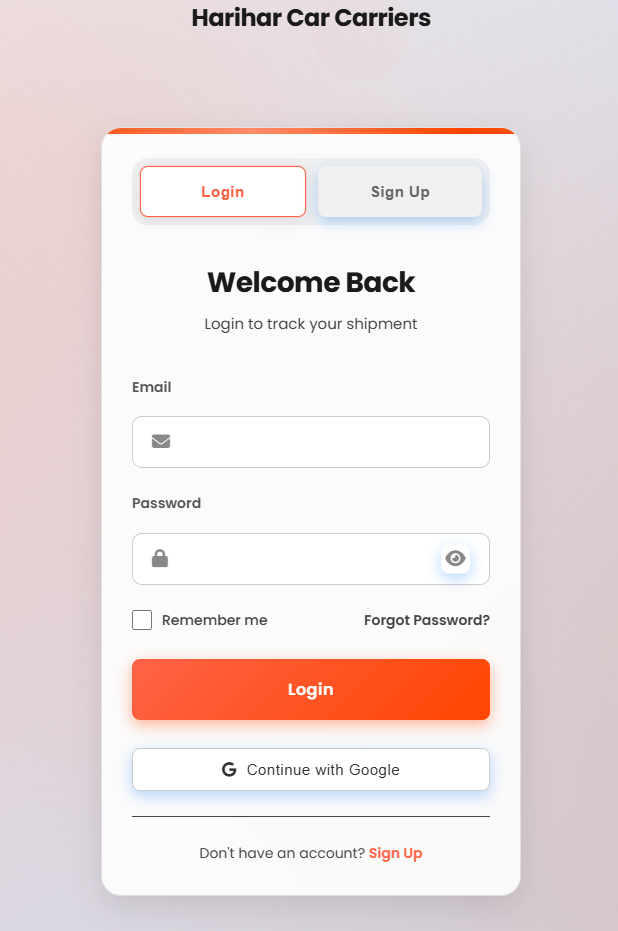

# 🚀 Feature: Google OAuth 2.0 Integration

### Description:
Implemented a secure, native authentication flow using Google OAuth 2.0 for the MERN platform. This allows customers to seamlessly sign up, log in, and establish active JWT sessions directly using their Google accounts, enhancing onboarding speed, UI aesthetics, and backend security.

---

### Key Changes & Architecture:

**Frontend (Vanilla HTML/JS + CSS):**
- Added a highly responsive, glassmorphic "Continue with Google" button into the login/sign-up forms (`frontend/pages/login.html`). Matches global Light/Dark themes dynamically.
- Implemented a dedicated bridge listener (`frontend/auth-callback.html`) that parses the raw JWT tokens from the backend redirection securely.
- Handled robust dynamic Base64 padding prior to calling `atob()` during decoding to cleanly prevent specific `DOMException` string-resolution crashes across multiple browser engines.
- Actively coordinates frontend state by synchronizing exactly what `navbar.js` and `dashboard.html` expect in `localStorage` (`authToken`, `userData`, and explicitly `userEmail`), ensuring precise UI propagation.

**Backend (Node.js + Express):**
- Engineered core routes at `api/auth/google`, utilizing `passport-google-oauth20` strategy to initiate secure Google Cloud OAuth handshakes.
- Patched critical node compatibility missing-method errors by constructing inline "shims" resolving Passport.js expectations natively tracking `.save()` and `.regenerate()` against fast, memory-managed `cookie-session` stores (`server.js`).
- Redirects authenticated profiles into robust JSON Web Tokens securely bridged natively to `auth-callback.html`.

**Database (MongoDB + Mongoose):**
- Augmented the `User` model to map `googleId` seamlessly.
- **Resilience Engine Configured**: Mongoose schema temporarily configures an invisible, mathematically guaranteed unique string inside `username` during active insertion to transparently bypass an existing legacy strict `username_1` global DB lock/constraint. Safely averts node-process terminating `E11000 duplicate key` exceptions explicitly for users holding empty constraints.

---

### Environment Variables Required:
Ensure to update root `backend/.env` files with these precise flags. *(Refer to `.env.example`)*

```env
# Google Cloud Console Auth Integration
GOOGLE_CLIENT_ID="<your_google_client_id>"
GOOGLE_CLIENT_SECRET="<your_google_client_secret>"
GOOGLE_CALLBACK_URL="http://localhost:3000/api/auth/google/callback" 

# Base Web Architecture (Crucial for callback handshakes)
CLIENT_URL="http://127.0.0.1:5500" 

# Secrets (Required)
JWT_SECRET="<your_jwt_secret>"
SESSION_SECRET="<your_cookie_session_secret>"
```

---

### Deployment Action Requirements ⚠️
If migrating strictly out of Developer "Localhost" mode into Live Production, you must:
1. Update `CLIENT_URL` to reflect the definitive Live Frontend address `https://domain.com`.
2. Update `GOOGLE_CALLBACK_URL` to point to your precise Live API endpoint `https://api.domain.com/api/auth/google/callback`.
---

### 📷 Testing & Validation Clips
To ensure a smooth PR approval, please include the following clips/screenshots:

1. **Auth Flow Recording**: Record a short video (MP4/GIF) from clicking "Continue with Google" -> Selection -> Redirection to User Dashboard.
2. **Theme Toggle Visuals**: Screenshots showing the Google Button in both **Light Mode** (Dark text on white) and **Dark Mode** (White button with Google branding).
3. **Responsive Check**: A screenshot of the login page on a mobile viewport (Chrome DevTools Mobile view) showing the Google button.
4. **Console Logs**: A screenshot of the browser console after logout and login showing "Logged out successfully" and the session initialization (ensure no red error logs).



<!-- Video Demo Player -->
[https://github.com/siddhi070306/car-transport-service/raw/google_auth/20260418-1758-28.7478801.mp4](https://github.com/user-attachments/assets/6b493ac2-6595-4ed2-9c4c-7162fcdd618d)

### 🛠️ Manual Testing Steps:
1. Clear `localStorage` in browser.
2. Navigate to `/frontend/pages/login.html`.
3. Check button contrast in both themes.
4. Trigger Google Auth.
5. Verify redirection to `/frontend/pages/dashboard.html`.
6. Verify profile data (Name/Avatar) appears in the Navbar correctly.
7. Click 'Logout' and ensure redirection back to login.

