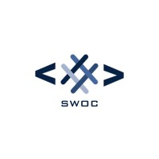
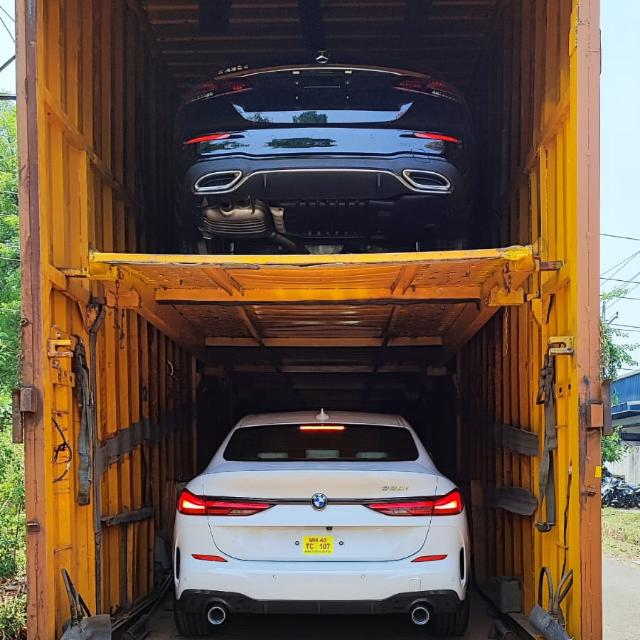

## 🚨 Contributor Registration

Before starting any contribution, you can complete the registration form if you want.

👉 Registration Form: https://forms.gle/2aVtenoaHg65qi4G7

⚠️ Submitted data is confidential and visible only to the Project Admin for future opportunities.

## 🌟 Open Source Participation

| Program | Program Name | Start Date | End Date |
|--------|--------------|------------|----------|
|  | **Nexus Spring of Code (NSOC)** | April 2026 | Present 2026 |
|  | **Social Winter of Code (SWOC)** | January 2026 | March 2026 |
|  | **Winter of Code Social (WOCS)** | November 2025 | January 2026 |


## 🧑‍💻 Open Source Contributors Welcome!

Join our official Discord server to:
- Ask and clear doubts
- Discuss issues and Pull Requests
- Get guidance from mentors
- Collaborate with contributors

👉 Discord: https://discord.gg/3FKndgyuJp


> 🚘 **Fast • Safe • Reliable Car Transport Services Across India**�

[](https://github.com/your-username/car-transport-website)  
[](https://github.com/your-username/car-transport-website/issues)  
[](LICENSE)

---

## 🌟 Project Overview

**Car Transport Service** is a **beginner-friendly, responsive website** built using **HTML, CSS, and JavaScript**.  
The project is **open-source** and welcomes contributions from developers of all skill levels.  

Currently, the website has basic structure and design. Contributors are encouraged to help improve it by:  

- Enhancing the layout and styling  
- Making the website fully **responsive** for mobile and tablet  
- Adding interactive JavaScript features  
- Adding additional pages (Services, About, Contact, etc.)  
- Optimizing images, fonts, and other assets  

## 📑 Table of Contents
- [About the Project](#about-the-project)
- [Tech Stack](#-tech-stack)
- [Features](#features)
- [Roadmap](#️-project-roadmap)
- [How to Contribute](#how-to-contribute)
- [Contact](#contact)
---

## 📁 Project Structure

```
car-transport-service/
│
├── frontend/                # All frontend code
│   ├── index.html          # Main landing page
│   ├── services.html       # Services page
│   ├── login.html          # Login/Signup page
│   ├── pages/              # Additional HTML pages
│   │   ├── about.html
│   │   ├── booking.html
│   │   ├── contact.html
│   │   ├── pricing.html
│   │   ├── gallery.html
│   │   └── ... (more pages)
│   ├── assets/
│   │   ├── images/         # Logos, photos, banners
│   │   ├── icons/          # SVGs and icon files
│   │   ├── fonts/          # Custom fonts
│   │   ├── data/           # JSON data files
│   │   └── gallery/        # Gallery images
│   ├── components/         # Reusable HTML components
│   │   ├── navbar.html
│   │   ├── footer.html
│   │   └── region-section.html
│   ├── css/
│   │   ├── styles.css      # Main CSS
│   │   ├── light-mode.css
│   │   ├── dark-mode.css
│   │   └── components/     # Component-specific CSS
│   └── js/
│       ├── script.js       # Main JavaScript
│       └── modules/        # JavaScript modules
│
├── backend/                # Backend services (planned for Q1 2026)
├── api/                    # API gateway & microservices (planned)
├── mobile-app/             # React Native app (planned for Q2 2026)
│
├── docs/                   # Documentation
│   ├── API_DOCS.md
│   ├── CONTRIBUTING.md
│   ├── ROADMAP.md
│   └── DESIGN_GUIDELINES.md
│
├── scripts/                # Build & deployment scripts
│
├── .github/
│   ├── ISSUE_TEMPLATE/     # Issue templates
│   ├── PULL_REQUEST_TEMPLATE.md
│   └── workflows/          # GitHub Actions
│
├── .gitignore
├── README.md
├── LICENSE
└── SECURITY.md
```

---

## 🎨 Screenshot / Demo

> Add screenshots of your website here for contributors to see

  

---

## 🤝 How to Contribute

We welcome **all types of contributions**, from fixing typos to adding features. 

Your Star ⭐️ makes a difference! Star ⭐️ this repo to help us reach more developers.

🪄 **Before you start:**  
Please **create an issue** first and wait for the project admin to **assign it to you**.  
Once assigned, follow the steps below:

1. **Fork** the repository  
2. **Clone** your fork:
```bash
git clone https://github.com/your-username/car-transport-service.git
cd car-transport-service
```
3. Create a **feature branch**:
```bash
git checkout -b feature-name
```
4. Make your changes and **commit**:
```bash
git commit -m "Add feature: description"
```
5. **Push** to your branch:
```bash
git push origin feature-name
```
6. Open a **Pull Request** and describe your changes.  

> 📖 For detailed guidelines, see [CONTRIBUTING.md](docs/CONTRIBUTING.md)  

---

### ✅ Contribution Guidelines
- Follow clean & readable code practices  
- Write proper commit messages  
- Add comments if required  
- Respect Code of Conduct

> 📚 **Read More:**  
> - [Contributing Guidelines](docs/CONTRIBUTING.md)  
> - [Project Roadmap](docs/ROADMAP.md)  
> - [Design Guidelines](docs/DESIGN_GUIDELINES.md)  
> - [Folder Structure](docs/FOLDER_STRUCTURE.md)  
> - [Coding Guidelines](docs/CODING_GUIDELINES.md)  
> - [Naming Conventions](docs/NAMING_CONVENTIONS.md)

> ⭐ Don't forget to **star** the repo if you like this project!

## 📝 Issues

If you find bugs or have ideas for new features, please open an **issue** on GitHub.  
Use labels like `bug`, `enhancement`, or `help wanted` to help contributors.  

---

## 🛠 Tech Stack

- Markup language     
-  Styling and layout  
- Interactivity    
- Optional: **Bootstrap / jQuery / Api** for additional features

---

## 📌 License

This project is licensed under the **MIT License** – see the [LICENSE](LICENSE) file for details.  

---

## 🙌 Contributors

Contributions are always welcome!  
Feel free to **fork, create issues, submit PRs**, or even suggest ideas.  

> Let’s build this website together and make it the best Car Transport website possible! 🚗💨

Thanks to all wonderful contributors ❤️

<!-- <a href="https://github.com/Nikhilrsingh/car-transport-service/graphs/contributors">
  
</a> -->

> ## 🗺️ Project Roadmap

✅ Initial UI & Page Structure  
✅ Basic Navigation  
✅ Service Information Pages  

🚧 Coming Soon:
- ✅ Mobile Responsive Design
- ✅ Contact & Booking Form
- ✅ Google Maps Pickup & Drop Integration
- ✅ Smooth Scroll & Basic Animations
- ✅ Customer Testimonials Section
- ✅ Footer Redesign
- ✅ Theme Optimization & Accessibility

✨ Open for Suggestions!

---


## ✨ Contributors

#### Thanks to all the wonderful contributors 💖

<a href="https://github.com/Nikhilrsingh/car-transport-service/graphs/contributors">
  
</a>

#### See full list of contributors [Contribution Graph](https://github.com/Nikhilrsingh/car-transport-service/graphs/contributors)  
